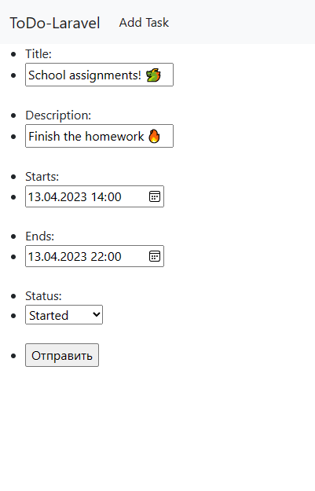

<h1>To-do list 📃🐲🔥</h1>

A simple to-do list implemented in PHP using Laravel.

<table>
    <thead>
        <tr>
            <th></th>
            <th></th>
        </tr>
    </thead>
    <tbody>
        <tr>
            <td style="text-align: center; font-style: italic;">Homepage</td>
            <td style="text-align: center; font-style: italic;">Task editing page example</td>
        </tr>
    </tbody>
</table>

<table>
    <thead>
        <tr>
            <th></th>
            <th></th>
        </tr>
    </thead>
    <tbody>
        <tr>
            <td colspan=2 style="text-align: center; font-style: italic;">Task creation page example</td>
        </tr>
    </tbody>
</table>

<h1 style="text-align: center;">Installation</h1>
<h2>Building from source</h2>

<h1 style="text-align: center;">Author</h1>

* Zephyr ([@ZaBlazzingZephyrus](https://github.com/ZaBlazzingZephyrus))
  
<h1 style="text-align: center;">License</h1>

The website and source code are distributed under the [MIT license](https://opensource.org/license/mit/). See [LICENSE](https://github.com/ZaBlazzingZephyrus/ToDoList/blob/develop/LICENSE). External libraries used by the to-do list are distributed under their own licenses.

<h1 style="text-align: center;">Third-Party Libraries</h1>

* [Laravel](https://github.com/laravel/laravel) is under the [MIT License](https://opensource.org/license/mit/)

<table>
  <tr style="border: none;">
    <td rowspan=2 style="border: none;">
        
    </td>
    <td style="border: none;">
        Provided by 
        <a href="https://github.com/ZaBlazzingZephyrus">
            @ZaBlazzingZephyrus
        </a>
    </td>
  </tr>
  <tr style="border: none; background-color: transparent;">
    <td style="border: none; font-style: italic;">
        Posted: April 16, 2023 19:00 UTC+7
        
    </td>
  </tr>
</table>